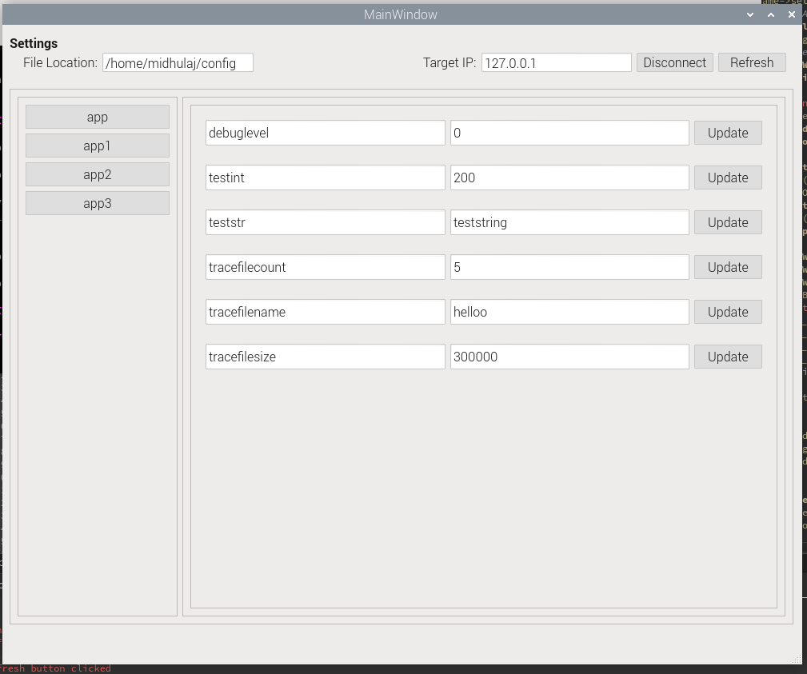

# Configurator
- An application configuration tool using Redis-DB to edit the application configuration saved appname.cfg file. 

- This [Application](https://github.com/midhu313/ConfiguratorTestApp) is a comapanion app for testing this.
- Uses the following struct
```sh
typedef struct {
    char config_file_name[80];
    char param_name[40];
    char value[40];
}Config_Update_Params_S;
```
